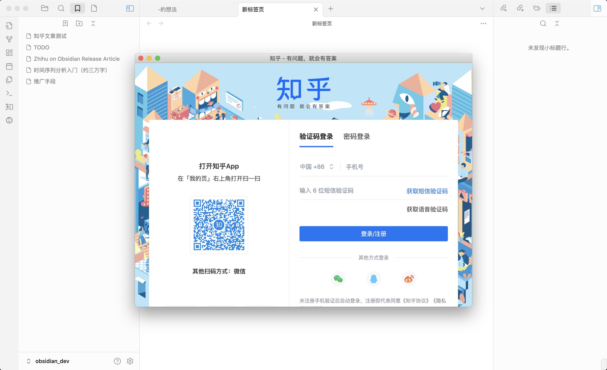
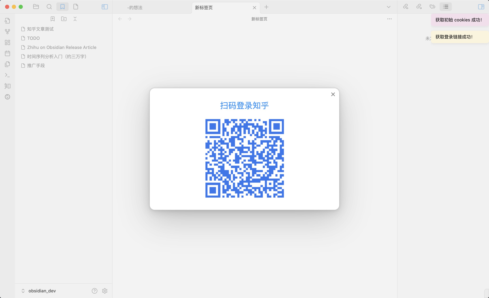
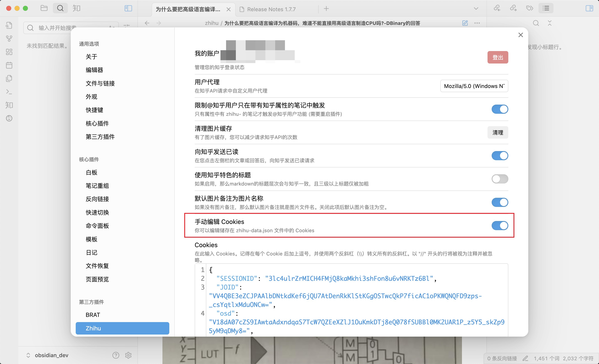

import Tabs from '@theme/Tabs';
import TabItem from '@theme/TabItem';

目前 Zhihu on Obsidian 有三种登录方式，它们是：网页登录(Web login)、二维码登录(QRCode login)、手动登录(Manual login)。

## 网页登录（推荐）

打开 Obsidian 的命令面板，通常快捷键是 `Ctrl+P` 或者 `Command+P`。输入`Zhihu: Web login`，会发现有一个知乎网页端的弹窗出现。



打开手机知乎扫一扫左边的二维码，**在手机端点击确认**，确认后网页会自动跳转，跳转到一个回答或者文章页面。耐心等待一切完成后，弹窗会**自动关闭**。

## 二维码登录

打开 Obsidian 的命令面板，通常快捷键是 `Ctrl+P` 或者 `Command+P`。输入`Zhihu: QRCode login`，会发现有一个知乎二维码的弹窗出现。



打开手机知乎扫一扫左边的二维码，**在手机端点击确认**。确认完成后即可登录。

:::warning 网页登录与二维码登录
二维码登录会比网页登录少很多cookie信息，因此只能发文章、发回答。而不能浏览知乎。因此桌面端更推荐使用网页登录。
:::

## 手动登录

手动登录适合网页登录失效的情况，类似 Zhihu on VSCode 目前的状况。手动登录看似步骤多，但原理很简单：知乎通过 cookie 来判断登录状态，所以只要把浏览器的 cookie 放入插件内就可以了。

首先进入[知乎](https://www.zhihu.com/)，随便点进一个回答或者文章，浏览器按F12打开控制台。

在控制台输入下面的JavaScript代码

```javascript
JSON.stringify(
    Object.assign(
        {},
        ...document.cookie.split("; ").map((c) => {
            const [key, ...rest] = c.split("=");
            const value = rest.join("=");
            return { [key]: decodeURIComponent(value) };
        }),
    ),
    null,
    2,
);
```


将得到的结果复制。再进入插件设置，打开 `手动编辑cookies`。



将上面复制的 JSON 放入编辑器中。

上面获取的 是 unsecured 的 cookie。还有一个 cookie 是 HttpOnly 的，非常重要但是不能被 Javascript 获取，因此只能手动获取。下面是 Firefox 和 Chrome 浏览器的获取方式：

<Tabs>
<TabItem value="firefox" label="Firefox">
在知乎网页端的控制台中，点击`存储`。在 cookie 列表中搜索 `z_c0`，复制其值。

</TabItem>
<TabItem value="chrome" label="Chrome">
在知乎网页端的控制台中，点击`应用`->`Cookie`。在 cookie 列表中搜索 `z_c0`，复制其值。

</TabItem>
</Tabs>

最后将复制后的 `z_c0` 值放入 cookie 编辑器中。

```JSON
{
  "SESSIONID": "xxx",
  "JOID": "xxx",
  ...
  "z_c0": "xxx" // 放入刚刚复制的JSON中
}
```


点击刷新，如果看到设置中出现了自己头像，说明登录成功。
